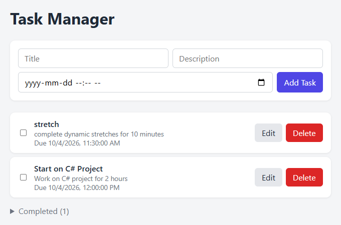
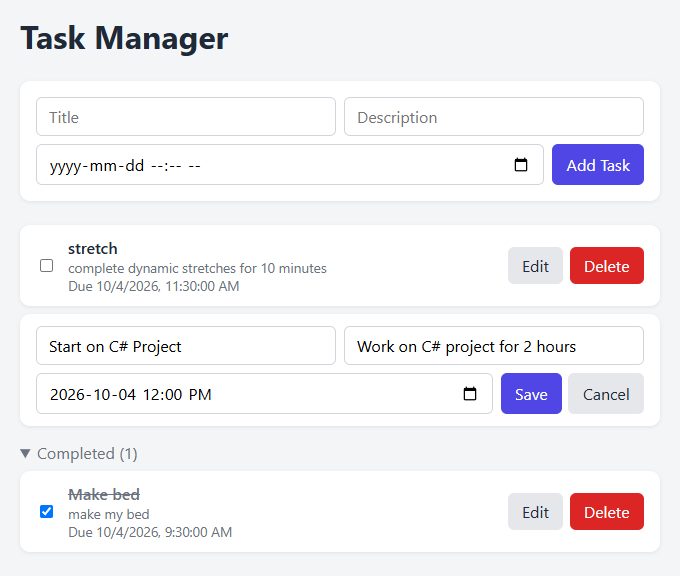

# Task Manager

A full-stack task management web app built with **C# / ASP.NET Core** and **React + TypeScript**. Users can create, edit, complete and delete tasks. Tasks are stored in a SQLite database through a RESTful API.

I built this project to practise how a typical business application fits together, from the database through the API to the user interface.

## Screenshots





## Features

- **Create tasks** with a title, optional description and optional due date
- **Edit tasks** inline without leaving the page
- **Mark tasks complete** with a checkbox. Completed tasks move into a collapsible "Completed" section
- **Delete tasks**
- **Saved data**: every change is stored in a SQLite database through the API

## Tech Stack

| Layer    | Technology                                             |
| -------- | ------------------------------------------------------ |
| Backend  | C#, .NET 9, ASP.NET Core Web API                       |
| Data     | Entity Framework Core 9, SQLite, code-first migrations |
| API docs | OpenAPI + Swagger UI                                   |
| Frontend | React 19, TypeScript, Vite                             |
| Tooling  | Git, ESLint, VS Code                                   |

## Skills Demonstrated

- **REST API design**: CRUD endpoints with appropriate HTTP verbs and status codes (`200`, `201`, `204`, `400`, `404`)
- **Database work**: a data model defined in C#, with the schema managed through EF Core migrations
- **Layered backend**: separate Models, Data (DbContext) and Controllers, with dependency injection for the database context
- **Frontend development**: reusable typed React components, state management with hooks, and a separate API client module
- **Integration**: frontend and backend connected over HTTP, with CORS configured for the client origin
- **Version control**: built step by step with Git, starting as a monorepo with `backend/` and `frontend/` folders

## Project Structure

```
TaskManager/
├── backend/TaskManager.Api/
│   ├── Controllers/TasksController.cs   # CRUD endpoints for /api/tasks
│   ├── Data/AppDbContext.cs             # EF Core database context
│   ├── Models/TaskItem.cs               # Task entity
│   ├── Migrations/                      # Database schema history
│   └── Program.cs                       # Services, CORS, middleware
└── frontend/taskmanager-client/src/
    ├── api/tasks.ts                     # Functions that call the API
    ├── components/
    │   ├── TaskForm.tsx                 # Form for adding a new task
    │   ├── TasksList.tsx                # Active list + collapsible completed list
    │   ├── TaskItem.tsx                 # A single task row
    │   ├── EditTaskForm.tsx             # Inline edit form
    │   └── CheckBox.tsx                 # Completion checkbox
    ├── types/Tasks.ts                   # Task TypeScript interface
    └── App.tsx                          # Holds app state and wires components together
```

## Running Locally

**Prerequisites:** [.NET 9 SDK](https://dotnet.microsoft.com/download/dotnet/9.0), [Node.js](https://nodejs.org/) 20+

**1. Start the API**

```bash
cd backend/TaskManager.Api
dotnet tool install --global dotnet-ef   # one-time setup
dotnet ef database update                # creates tasks.db from the migrations
dotnet run --launch-profile http
```

The API runs at http://localhost:5292. Swagger UI is at http://localhost:5292/swagger.

**2. Start the frontend** (in a second terminal)

```bash
cd frontend/taskmanager-client
npm install
npm run dev
```

Open http://localhost:5173 in your browser.

## API Endpoints

| Method | Route             | Description    | Responses                                                  |
| ------ | ----------------- | -------------- | ---------------------------------------------------------- |
| GET    | `/api/tasks`      | List all tasks | `200 OK`                                                   |
| GET    | `/api/tasks/{id}` | Get one task   | `200 OK`, `404 Not Found`                                  |
| POST   | `/api/tasks`      | Create a task  | `201 Created`, `400 Bad Request` if the title is missing   |
| PUT    | `/api/tasks/{id}` | Update a task  | `204 No Content`, `400` if the IDs differ, `404 Not Found` |
| DELETE | `/api/tasks/{id}` | Delete a task  | `204 No Content`, `404 Not Found`                          |

Example task:

```json
{
  "id": 1,
  "title": "Submit timesheet",
  "description": "Due end of pay period",
  "isCompleted": false,
  "createdAt": "2026-09-24T15:38:30Z",
  "dueDate": "2026-09-30T17:00:00Z"
}
```

## Possible Improvements

- Add user accounts and authentication
- Add server-side validation and unit tests for the API
- Add filtering and sorting by due date
- Deploy to Azure, with the database moved to SQL Server
